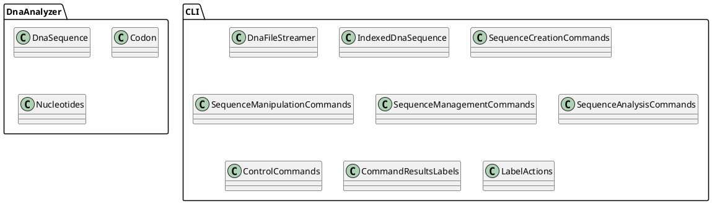

# DNA Analyzer package diagram

```plantuml
@startuml
!pragma useNewPackage
set separator none
package DnaAnalyzer {
  class DnaSequence
  class Codon
  class Nucleotides
}

package CLI {
  class DnaFileStreamer
  class IndexedDnaSequence
  class SequenceCreationCommands
  class SequenceManipulationCommands
  class SequenceManagementCommands
  class SequenceAnalysisCommands
  class ControlCommands
  class CommandResultsLabels
  class LabelActions
}
@enduml
```