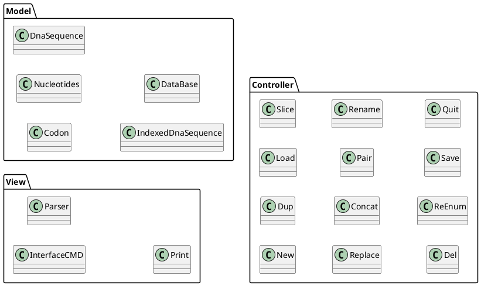

# DNA Analyzer package diagram

```plantuml
@startuml
!pragma useNewPackage
left to right direction

set separator none
package View{
  class InterfaceCMD
  class Parser
  class Print
}

package Model{
  class Codon
  class Nucleotides
  class DnaSequence
  class IndexedDnaSequence
  class DataBase
}

package Controller{
  class New
  class Dup
  class Load
  class Slice
  class Replace
  class Concat
  class Pair
  class Rename
  class Del
  class ReEnum
  class Save
  class Quit
}
@enduml
```