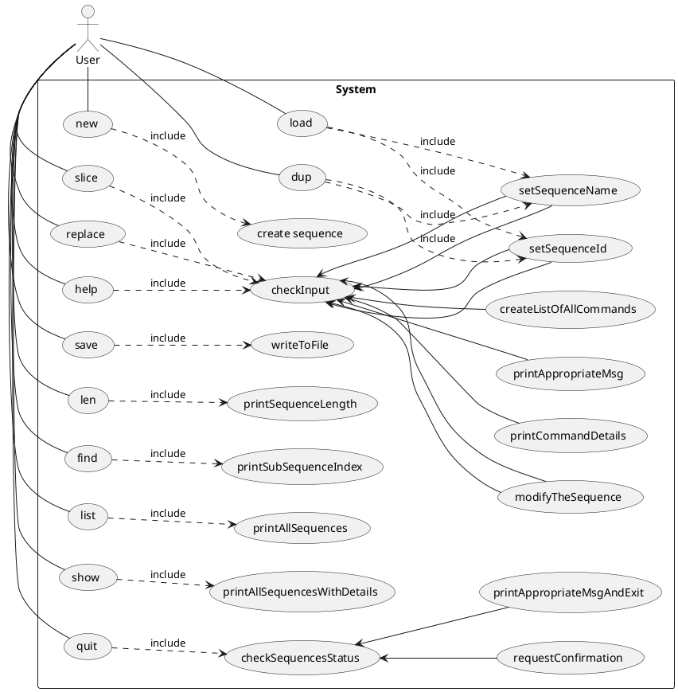

# DNA Analyzer use case

```plantuml
@startuml
left to right direction
actor User
' actor CLI
rectangle System{
    User - (new)
   ' (create sequence) - CLI
    (new) ..> (create sequence) : include  

    User - (load)
   ' (setSequenceName) - CLI
    '(setSequenceId) - CLI
    (load) ..> (setSequenceName) : include
    (load) ..> (setSequenceId) : include

    User - (dup)
    (dup) ..> (setSequenceName) : include
    (dup) ..> (setSequenceId) : include

    User - (slice)
    '(modifyTheSequence) - CLI
    (slice) ..> (checkInput) : include
    (checkInput) <-- (setSequenceName)
    (checkInput) <-- (setSequenceId)  
    (checkInput) <-- (modifyTheSequence)

    User - (replace)
    (replace) ..> (checkInput) : include
    (checkInput) <-- (setSequenceName)
    (checkInput) <-- (setSequenceId)  
    (checkInput) <-- (modifyTheSequence)

    User - (save)
   ' (writeToFile) - CLI
    (save) ..> (writeToFile) : include

    User - (len)
   ' (printSequenceLength) - CLI
    (len) ..> (printSequenceLength) : include

    User - (find)
    '(printSubSequenceIndex) - CLI
    (find) ..> (printSubSequenceIndex) : include

    User - (help)
    (help) ..> (checkInput) : include
    (checkInput) <-- (printCommandDetails)
    (checkInput) <-- (printAppropriateMsg)  
    (checkInput) <-- (createListOfAllCommands)

    User - (list)
    '(printAllSequences) - CLI
    (list) ..> (printAllSequences) : include

    User - (show)
   ' (printAllSequencesWithDetails) - CLI
    (show) ..> (printAllSequencesWithDetails) : include

    User - (quit)
    (quit) ..> (checkSequencesStatus) : include
    (checkSequencesStatus) <-- (requestConfirmation)
    (checkSequencesStatus) <-- (printAppropriateMsgAndExit)  
}
@enduml
```
