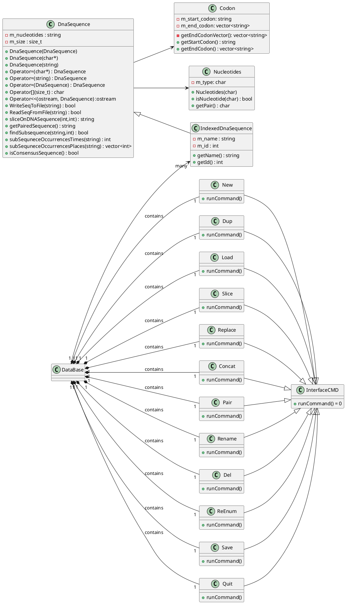

# UML

```plantuml
@startuml

left to right direction

class DnaSequence{
    - m_nucleotides : string
    - m_size : size_t
    + DnaSequence(DnaSequence)
    + DnaSequence(char*)
    + DnaSequence(string)
    + Operator=(char*) : DnaSequence
    + Operator=(string) : DnaSequence
    + Operator=(DnaSequence) : DnaSequence
    + Operator[](size_t) : char
    + Operator<<(ostream, DnaSequence) :ostream
    + WriteSeqToFile(string) : bool
    + ReadSeqFromFile(string) : bool
    + sliceOnDNASequence(int,int) : string
    + getPairedSequence() : string
    + findSubsequence(string,int) : bool
    + subSequneceOccurrencesTimes(string) : int
    + subSequneceOccurrencesPlaces(string) : vector<int>
    + isConsensusSequence() : bool
}

class Codon{
    - m_start_codon: string
    - m_end_codon: vector<string>
    - getEndCodonVector(): vector<string>
    + getStartCodon() : string
    + getEndCodon() : vector<string>
}

class Nucleotides{
    - m_type: char
    + Nucleotides(char)
    + isNucleotide(char) : bool
    + getPair() : char
}

class IndexedDnaSequence{
    -m_name : string
    -m_id : int
    +getName() : string
    +getId() : int
}

class New{
    +runCommand()
}

class Dup{
    +runCommand()
}

class Load{
    +runCommand()
}

class Slice{
    +runCommand()
}

class Replace{
    +runCommand()
}

class Concat{
    +runCommand()
}

class Pair{
    +runCommand()
}


class Rename{
    +runCommand()
}

class Del{
    +runCommand()
}

class ReEnum{
    +runCommand()
}

class Save{
    +runCommand()
}


class Quit{
    +runCommand()
}

class InterfaceCMD{
    +runCommand() = 0
}

class DataBase{}

DnaSequence --> Codon
DnaSequence --> Nucleotides
DnaSequence <|-- IndexedDnaSequence
DataBase "1" *-- "1" New : contains
DataBase "1" *-- "1" Dup : contains
DataBase "1" *-- "1" Load : contains
DataBase "1" *-- "1" Slice : contains
DataBase "1" *-- "1" Replace : contains
DataBase "1" *-- "1" Concat : contains
DataBase "1" *-- "1" Pair : contains
DataBase "1" *-- "1" Rename : contains
DataBase "1" *-- "1" Del : contains
DataBase "1" *-- "1" ReEnum : contains
DataBase "1" *-- "1" Save : contains
DataBase "1" *-- "1" Quit : contains
DataBase "1" --> "many" IndexedDnaSequence 

New --|> InterfaceCMD
Dup --|> InterfaceCMD
Load --|> InterfaceCMD
Slice --|> InterfaceCMD
Replace --|> InterfaceCMD
Concat --|> InterfaceCMD
Pair --|> InterfaceCMD
Rename --|> InterfaceCMD
Del --|> InterfaceCMD
ReEnum --|> InterfaceCMD
Save --|> InterfaceCMD
Quit --|> InterfaceCMD
@enduml
```
