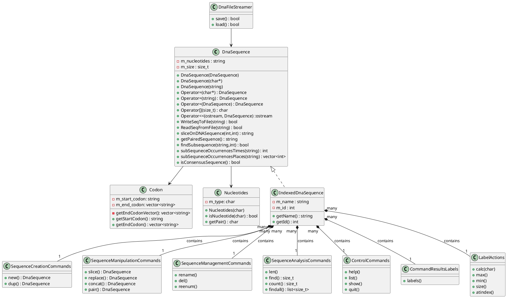

# UML

```plantuml
@startuml

top to bottom direction

class DnaSequence{
    - m_nucleotides : string
    - m_size : size_t
    + DnaSequence(DnaSequence)
    + DnaSequence(char*)
    + DnaSequence(string)
    + Operator=(char*) : DnaSequence
    + Operator=(string) : DnaSequence
    + Operator=(DnaSequence) : DnaSequence
    + Operator[](size_t) : char
    + Operator<<(ostream, DnaSequence) :ostream
    + WriteSeqToFile(string) : bool
    + ReadSeqFromFile(string) : bool
    + sliceOnDNASequence(int,int) : string
    + getPairedSequence() : string
    + findSubsequence(string,int) : bool
    + subSequneceOccurrencesTimes(string) : int
    + subSequneceOccurrencesPlaces(string) : vector<int>
    + isConsensusSequence() : bool
}

class Codon{
    - m_start_codon: string
    - m_end_codon: vector<string>
    - getEndCodonVector(): vector<string>
    + getStartCodon() : string
    + getEndCodon() : vector<string>
}

class Nucleotides{
    - m_type: char
    + Nucleotides(char)
    + isNucleotide(char) : bool
    + getPair() : char
}

class DnaFileStreamer{
    +save() : bool
    +load() : bool
}

class IndexedDnaSequence{
    -m_name : string
    -m_id : int
    +getName() : string
    +getId() : int
}

class SequenceCreationCommands{
    +new() : DnaSequence
    +dup() : DnaSequence
}

class SequenceManipulationCommands{
    +slice() : DnaSequence
    +replace() : DnaSequence
    +concat() : DnaSequence
    +pair() : DnaSequence
}

class SequenceManagementCommands{
    +rename()
    +del()
    +reenum()
}

class SequenceAnalysisCommands{
    +len()
    +find() : size_t
    +count() : size_t
    +findall() : list<size_t>
}

class ControlCommands{
    +help()
    +list()
    +show()
    +quit()
}

class CommandResultsLabels{
    +labels()
}

class LabelActions{
    +calc(char)
    +max()
    +min()
    +size()
    +atindex()
}

DnaSequence --> Codon
DnaSequence --> Nucleotides
DnaFileStreamer --> DnaSequence
DnaSequence <|.. IndexedDnaSequence
IndexedDnaSequence "many" *-- "1" SequenceCreationCommands : contains
IndexedDnaSequence "many" *-- "1" SequenceManipulationCommands : contains
IndexedDnaSequence "many" *-- "1" SequenceManagementCommands : contains
IndexedDnaSequence "many" *-- "1" SequenceAnalysisCommands : contains
IndexedDnaSequence "many" *-- "1" ControlCommands : contains
IndexedDnaSequence "many" *-- "1" CommandResultsLabels : contains
IndexedDnaSequence "many" *-- "1" LabelActions : contains

@enduml
```
